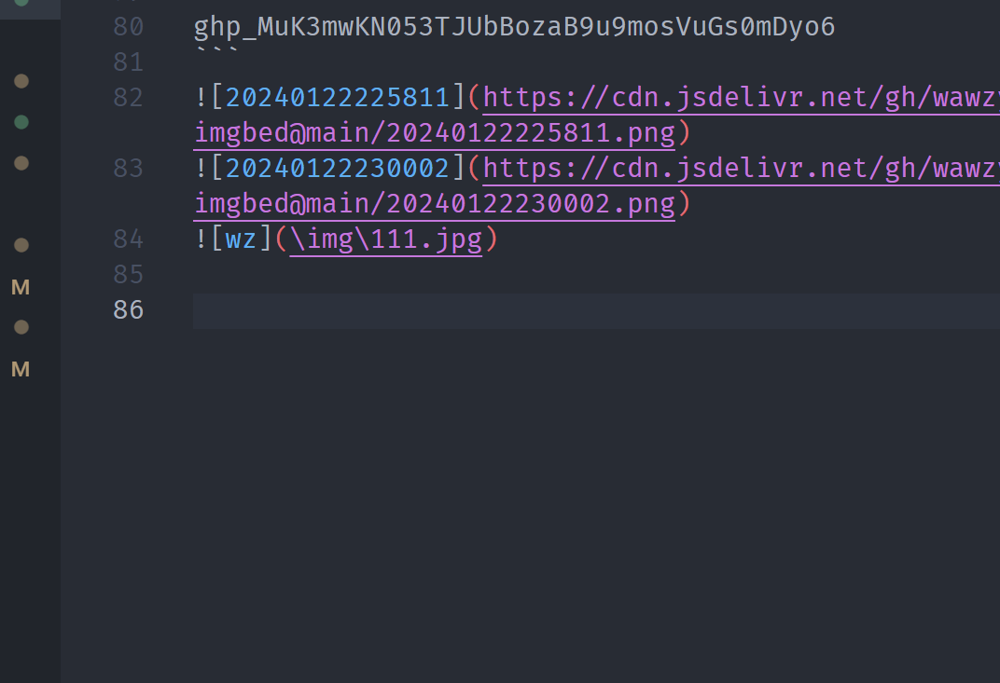

### 安装gcc

## 安装home brew

```
/bin/zsh -c "$(curl -fsSL https://gitee.com/cunkai/HomebrewCN/raw/master/Homebrew.sh)"

```

## gcc

### 安装gcc

brew install gcc

### 地址

```
wz@MBP-2D11ATMD6P-0038 c++ % which gcc-14
which g++-14

/usr/local/bin/gcc-14
/usr/local/bin/g++-14
```

## sublime

### packages

command + shift + p 安装
安装cppfastolympic 
`control + b`运行

### 修改cppfastplympic的cpp编译选择

```
        {
            "name": "C++",
            "extensions": ["cpp"],
            "compile_cmd": "/usr/local/bin/g++-14 '{source_file}' -Wall -Wextra -g -std=c++17 -pedantic -o '{file_name}'",
            "run_cmd": "./'{file_name%.*}' {args} -debug && rm -f '{file_name}'", //删除mac生成的同名二进制文件
            "lint_compile_cmd": "/usr/local/bin/g++-14 -std=c++17 -Wall -Wextra -g -pedantic '{source_file}' -I '{source_file_dir}'"
        },

```

### 改变生成tests的位置

```
    // closing sidebar when executing
    "close_sidebar": false, 

    // tests files dir
    "tests_relative_dir": "tests"
```

## vscode

tasks.json

```
{
    "version": "2.0.0",
    "tasks": [
        {
            "label": "single file build",
            "type": "shell",
            "command": "/usr/local/bin/g++-14",
            "args": [
                "-g",
                "${file}",
                "-o",
                "${fileDirname}/${fileBasenameNoExtension}.out",
                "-std=c++17",
                "-pedantic"
            ],
            "group": "build",
            "problemMatcher": [
                "$gcc"
            ],
            "presentation": {
                "echo": true,
                "reveal": "silent",
                "focus": false,
                "panel": "shared",
                "showReuseMessage": false,
                "clear": true
            }
        },
        {
            "label": "run and pause",
            "type": "shell",
            "command": "${fileDirname}/${fileBasenameNoExtension}.out",
            "dependsOn": "single file build",
            "group": {
                "kind": "test",
                "isDefault": true
            },
            "presentation": {
                "echo": true,
                "reveal": "always",
                "focus": true,
                "panel": "shared",
                "showReuseMessage": false,
                "clear": true
            },
            "problemMatcher": []
        },
        {
            "type": "cppbuild",
            "label": "C/C++: g++-14 生成活动文件",
            "command": "/usr/local/bin/g++-14",
            "args": [
                "-fdiagnostics-color=always",
                "-g",
                "${file}",
                "-o",
                "${fileDirname}/${fileBasenameNoExtension}"
            ],
            "options": {
                "cwd": "${fileDirname}"
            },
            "problemMatcher": [
                "$gcc"
            ],
            "group": {
                "kind": "build",
                "isDefault": true
            },
            "detail": "调试器生成的任务。"
        }
    ]
}
```

launch.json

```
{
  "version": "0.2.0",
  "configurations": [
    {
      "name": "single file debug",
      "type": "lldb",
      "request": "launch",
      "program": "${fileDirname}/${fileBasenameNoExtension}.out",
      "args": [],
      "cwd": "${fileDirname}",
      "environment": [],
      "externalConsole": true,
      "MIMode": "lldb",
      "miDebuggerPath": "/usr/bin/lldb",
      "stopAtEntry": false,
      "preLaunchTask": "single file build",
      "internalConsoleOptions": "neverOpen"
    }
  ]
}

```

c_cpp_properties.json

```
{
  "configurations": [
    {
      "name": "Mac",
      "includePath": [
        "${workspaceFolder}/**"
      ],
      "defines": [],
      "macFrameworkPath": [
        "/System/Library/Frameworks",
        "/Library/Frameworks"
      ],
      "compilerPath": "/usr/local/bin/g++-14",
      "cStandard": "c11",
      "cppStandard": "c++17",
      "intelliSenseMode": "macos-gcc-x64"
    }
  ],
  "version": 4
}

```


## 快速到达文件夹

点击访达右键 选择 前往文件夹 输入即可


如果python不好的话就改为 python3
python安装包 pip3

vscode一键配置`vcch`
cph 快捷键 control + option + b


截图 command + shift + 4
截图到粘贴板 command + control + shift + 4
锁屏 command + control + q
聚焦搜索 command + space
强制退出 command + option + esc

## ssh连接linux主机

首先在mac上下载vscode 然后下载ssh-romote
linux主机上：查看ip 终端输入 `ifconfig`
ssh 用户名@ip
ssh walle-sl@11.2.150.65

### 生成ssh

### 本地复制

### 传入服务器端authentications

下载gitblame / gitlens插件可以看代码谁写的


## vgn：

### 切换mac和windows

fn + a windows
fn + s mac

## Linux

### 更改终端

```
gedit ~/.bashrc

PS1='${debian_chroot:+($debian_chroot)}\[\033[00;35;01m\]\u\[\033[00;00;01m\]@\[\033[01;35;01m\]\h\[\033[00;31;01m\]:\[\033[00;33;01m\]\w \[\033[01;32;01m\]\$ \[\033[01;36;01m\]'
```

### 显示隐藏文件夹

`ctrl+H`

### 搜索之前用过的命令行

`ctrl+R`

## git

### 切换分支

```
git checkout -b new_branch
```

###  合并commit

```
git log --oneline
```

比如要合并四个分支
就找到第五个的`commit_id_5`

```
git rebase -i commit_id_5
```

按回车进入修改
把下面的`pick`改成`s`
保存退出

```
ls -a 
```


`pmp_object_pb.h` : Class MapObejct 


mac：快捷键
command + shift + / 
command + space
command "+" 命令行变大

## 阿里云服务器

### 更改主机名字

hostnamectl set-hostname 主机名
然后重启实例就可以


题目 3：最小换序代价
思路：
先记录 nums1 和 nums2 中相同的元素下标，将需要交换的元素索引存入优先队列。
优先从低代价开始交换，使用贪心策略选择交换代价最小的下标对。
如果所有下标都相同或无法进行足够多的交换，则返回 -1。
数据结构：
优先队列（Priority Queue）：用于按交换代价顺序存储需要交换的下标，以便逐对选取代价最低的交换。
时间复杂度：
O(n log n)，由于需要将 sameIndexes 中的下标对进行最小堆排序，插入优先队列的复杂度为 O(log n)。
空间复杂度：
O(n)，优先队列最多存储 n 个元素的下标。


题目 2：求一组算子的最短执行时间
思路：
使用滑动窗口方法，在不同的连续子序列中，找到一个满足条件的最优分配，使得总执行时间最小。
将一部分算子分配到向量计算单元，另一部分算子留给矩阵计算单元，以平衡两者的执行时间。
理想的执行时间是target = res / 7，然后滑动窗口遍历不同的分配，尝试最小化 max(res - s, 6 * s)。
数据结构：
数组：用于存储算子的执行时间。
滑动窗口：通过双指针方式遍历不同的子序列。
时间复杂度：
O(n)，滑动窗口仅需线性遍历整个数组。
空间复杂度：
O(1)，除了输入数组，无需额外空间。